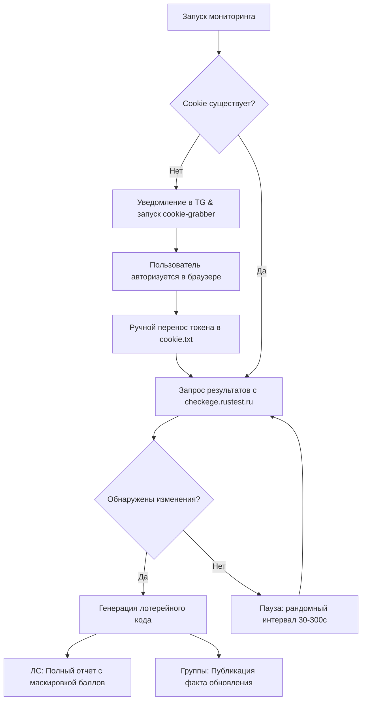

<div align="center">


<p align="center">
  
  
  
  
</p>


<p align="center">
  <b>Telegram-бот для автоматического отслеживания результатов ЕГЭ на портале checkege.rustest.ru.</b><br>
  Оповещает о публикации баллов без преждевременного раскрытия информации.
</p>

| [Как это работает](#как-это-работает) | [Схема процесса](#схема-процесса) | [Возможности](#возможности) | [Быстрый старт](#быстрый-старт) | [Переменные окружения](#переменные-окружения) | [Структура проекта](#структура-проекта) | [Деплой](#запуск-на-сервере) | [Безопасность](#безопасность) |
|---|---|---|---|---|---|---|---|

</div>

---

## Как это работает

При публикации нового результата бот отправляет уведомление, маскируя итоговые баллы под видом зашифрованного «лотерейного кода». Код состоит из 10 символов, где реальные цифры скрыты среди латинских букв. Каждая позиция отправляется отдельным сообщением со спойлером:

```markdown
Новый результат: Русский язык

Код:
||A|| ||B|| ||8|| ||C|| ||7|| ||D|| ||E|| ||F|| ||G|| ||H||
```

Пользователь может открывать спойлеры последовательно, исключая случайный просмотр оценки до психологической готовности.

---

## Схема процесса



---

## Возможности

*   **Лотерейное маскирование** — обфускация баллов внутри 10-символьной строки.
*   **Разграничение приватности** — детальная статистика доставляется только в ЛС администратору. В групповые чаты отправляется обезличенное уведомление.
*   **Автоматическое сопоставление** — бот самостоятельно определяет список предметов из доступных в личном кабинете.
*   **Авторизационный мост** — автоматический вызов браузера при отсутствии или невалидности сессионной куки.
*   **Интеллектуальный интервал** — динамический период опроса (30–300 сек) для защиты от блокировок.
*   **Отказоустойчивость** — мгновенное информирование администратора о сетевых сбоях и ошибках парсинга без остановки цикла мониторинга.

---

## Быстрый старт

### 1. Клонирование репозитория и установка зависимостей

```bash
git clone https://github.com/ваш-username/egestatbot.git
cd egestatbot
npm install
```

### 2. Подготовка окружения Telegram

1. Напишите [@BotFather](https://t.me/BotFather) и создайте бота через `/newbot`. Скопируйте полученный `BOT_TOKEN`.
2. Узнайте свой персональный ID через [@userinfobot](https://t.me/userinfobot) (параметр `id` для `ADMIN_CHAT_ID`).

### 3. Первый запуск и интерактивная настройка

```bash
npm run dev
```

При отсутствии файла `.env` инициализируется пошаговый мастер настройки прямо в консоли:

```text
┌────────────────────────────────────────────────────────┐
│                 egestatbot Setup                       │
├────────────────────────────────────────────────────────┤
│  ? Введите BOT_TOKEN: 123456789:AAFfake_token_example  │
│  ? Введите ADMIN_CHAT_ID: 123456789                    │
│  ? Введите GROUP_CHAT_IDS (опционально):               │
│                                                        │
│  ✔ Конфигурационный файл .env успешно создан!          │
└────────────────────────────────────────────────────────┘
```

### 4. Авторизация на портале

Если валидный файл `cookie.txt` отсутствует:

1. Бот пришлет системное уведомление в Telegram.
2. Локально откроется браузер со страницей `https://checkege.rustest.ru/exams`.
3. После авторизации скопируйте значение cookie-параметра `Participant`.
4. Вставьте скопированный токен в созданный файл `cookie.txt`.

Мониторинг автоматически применит новую сессию при следующем цикле опроса.

---

## Переменные окружения

<details>
<summary><b>Показать параметры конфигурации .env (Нажмите для раскрытия)</b></summary>

| Переменная | Обязательный | Значение по умолчанию | Описание |
|---|---|---|---|
| `BOT_TOKEN` | **Да** | *отсутствует* | Токен доступа к Telegram API |
| `ADMIN_CHAT_ID` | **Да** | *отсутствует* | Telegram ID администратора для получения оценок |
| `GROUP_CHAT_IDS` | Нет | *отсутствует* | ID групп через запятую для общих уведомлений |
| `MONITOR_SUBJECTS` | Нет | *все доступные* | Список отслеживаемых предметов через запятую |
| `CHECK_INTERVAL_BASE` | Нет | `120` | Базовая частота запросов в секундах (минимум 30) |

</details>

---

## Структура проекта

```text
egestatbot/
├── src/                  # Исходный код (TypeScript)
│   ├── index.ts          # Инициализация и главный цикл опроса
│   ├── bot.ts            # Модуль интеграции с Telegram Bot API
│   ├── parser.ts         # Парсинг ответов checkege.rustest.ru
│   ├── lottery.ts        # Алгоритм обфускации и генерации лотерейного кода
│   ├── config.ts         # Парсинг и валидация конфигурации .env
│   ├── setup.ts          # Интерактивный CLI-помощник инициализации
│   ├── state.ts          # Управление кэшем локального состояния
│   ├── cookie-grabber.ts # Модуль автоматического перенаправления на авторизацию
│   ├── types.ts          # Типизация структур данных
│   └── logger.ts         # Конфигурация Winston-логгера
├── tests/                # Модульные тесты
├── .env                  # Локальные переменные окружения (игнорируется git)
├── cookie.txt            # Сессионная кука авторизации (игнорируется git)
├── exams_state.json      # Кэш состояния оценок (игнорируется git)
└── logs/                 # Ротируемые файлы логов работы (игнорируются git)
```

---

## Запуск на сервере

Для развертывания в production-окружении выполните сборку проекта:

```bash
npm run build
npm start
```

### Управление процессом через PM2

Для обеспечения непрерывной фоновой работы процесса и автоматического перезапуска рекомендуется использовать менеджер процессов `pm2`:

```bash
npm install -g pm2
pm2 start dist/index.js --name egestatbot
pm2 save
```

Логи работы пишутся раздельно во временные файлы директории `logs/error.log` и `logs/combined.log` с автоматической ротацией (максимальный размер файла — 5 МБ, глубина хранения — 3 файла).

---

## Безопасность

*   Все файлы, содержащие персональные данные и параметры доступа (`.env`, `cookie.txt`, `exams_state.json`), а также директория `logs/` внесены в исключения `.gitignore`.
*   Чувствительные данные (баллы, структура оценок по критериям) отправляются исключительно в прямой диалог с администратором (`ADMIN_CHAT_ID`).
*   В общие группы отправляется только обезличенный сигнал об обновлении статуса проверки.

<div align="center">


</div>